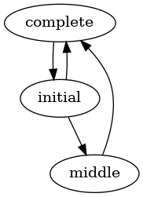

# MachineryDisplay

Turns [Machinery](https://github.com/joaomdmoura/machinery) state machines into
easy-to-digest graphics from an easy-to-call mix task. 

As simple as `$ mix machinery_display <project_name>`

## Example

```elixir
defmodule Example.SimpleTestStateMachine do
    use Machinery,
      field: :state,
      states: ["initial", "middle", "complete"],
      transitions: %{
        "initial" => ["middle", "complete"],
        "middle" => ["complete"],
        "complete" => "initial"
      }
end
```

Turns into



## System-level Dependencies

For generating [Graphviz/Dot](https://www.graphviz.org/) diagrams, you will need a Graphviz compiler. Most major operating systems have one available in their package repo.

### Ubuntu
`$ apt install graphviz`

### Fedora
`$ yum install graphviz`

### Mac
`$ brew install graphviz`

## Installation

The package can be installed by adding `machinery_display` to your list of dependencies in `mix.exs`:

```elixir
def deps do
  [
    {:machinery_display, "~> 0.2.0"}
  ]
end
```
